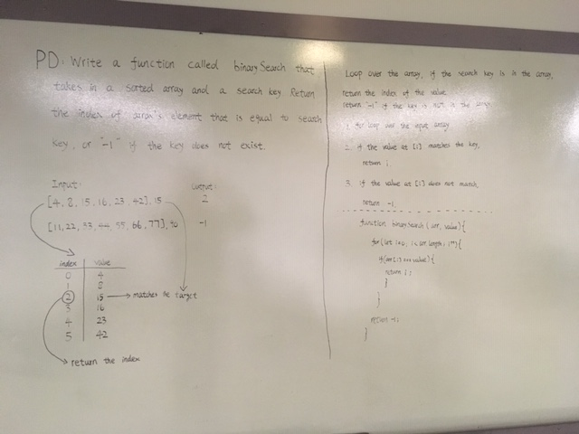

# Array Binary Search

## Challenge
Write a function called binarySearch that takes in a sorted array and a search key. Return the index of array's element that is equal to search key, or "-1" if the key does not exist. 

## Approach & Efficiency
I used for a regular for loop to figure this one out. 

## Solution
