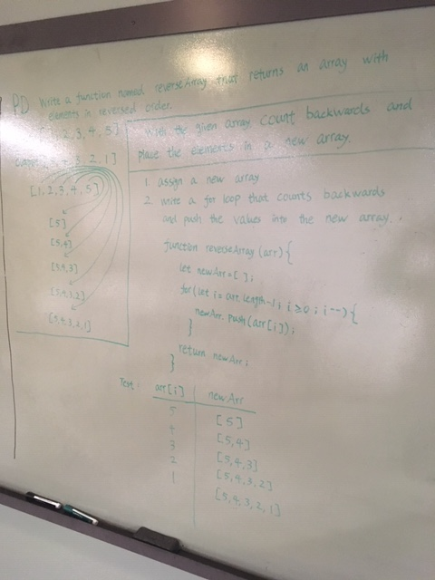

# Reverse an Array

## Challenge
write a function named reverseArray that takes in an array, and returns an array with elements in reversed order.

## Approach & Efficiency
I used a reverse for loop over the original array and placed the elements in a new array. 

## Solution

