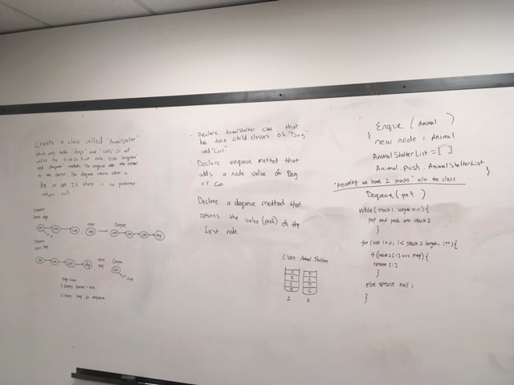

# Animal Shelter

## Challenge 
- Create a class called `AnimalShelter` which holds only dogs and cats. The shelter operates using a first-in, first-out approach.
- Implement the following methods:
    - `enqueue(animal)`: adds animal to the shelter. animal can be either a dog or a cat object.
    - `dequeue(pref)`: returns either a dog or a cat. If pref is not "dog" or "cat" then return null.

## Approach & Efficiency
For both of these methods, I created two separate array-like stacks inside the constructor; the enqueue method works. However the dequeue method is not working yet; I'm stuck on the for loop portion. 

## Solution

