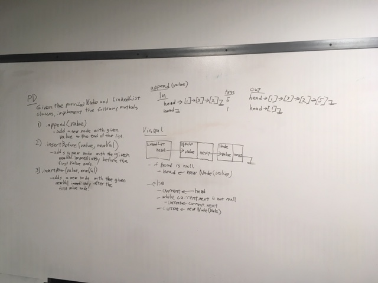
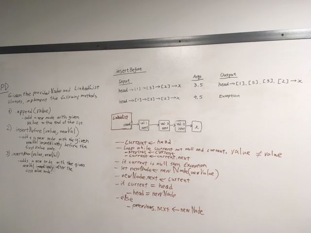

# Linked List Insertions

## Challenge
Write 3 methods for the Linked List class: 
  - `.append(value)` which adds a new node with the given `value` to the end of the list.
  - `.insertBefore(value,newVal)` which adds a new node with the given `newValue` immediately before the first `value` node.
  - `.insertAfter(value,newVal)` which adds a new node with the given `newValue` immediately after the first `value` node.

## Approach & Efficiency
I haven't been able to figure this one out yet. I will continue to work on this one. 

## Solution

