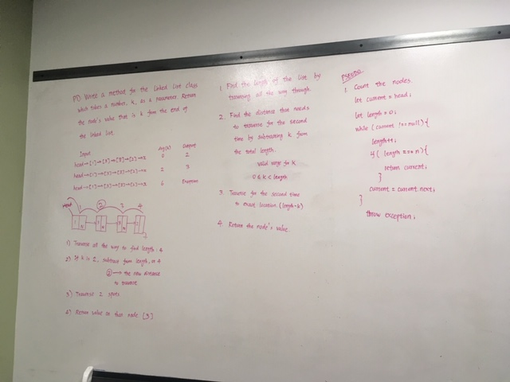

# Kth value from the end of a linked list

## Challenge
Write a method for the Linked List class which takes a number, k, as a parameter. Return the node’s value that is k from the end of the linked list.

## Approach & Efficiency
I haven't been able to figure this one out yet. I will continue to work on this one. 

## Solution

