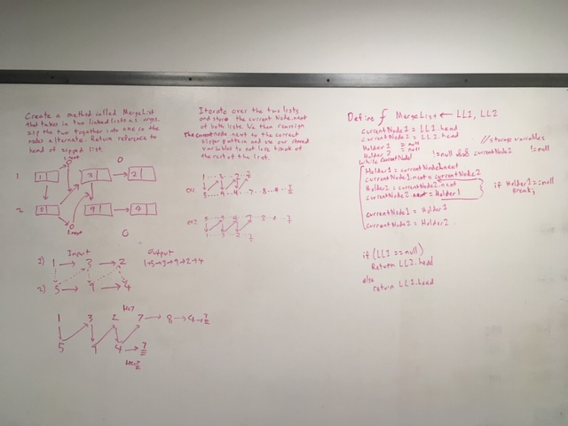

# ll-merge

## Challenge
Write a function called mergeLists which takes two linked lists as arguments. Zip the two linked lists together into one so that the nodes alternate between the two lists and return a reference to the head of the zipped list.

## Approach & Efficiency
Chris and I used "holder" variables, using a "zig zag" pattern, within a while loop, to return a new list. 

## Solution
