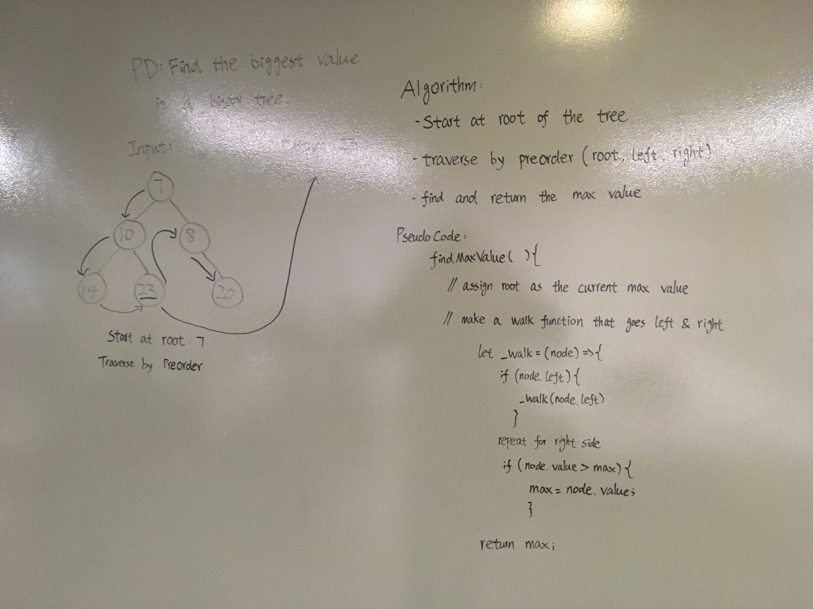

# Find Maximum Value in a Binary Tree 
- Code Challenge 18

## Challenge
- Write an instance method called find-maximum-value. Without utilizing any of the built-in methods available to your language, return the maximum value stored in the tree. You can assume that the values stored in the Binary Tree will be numeric.

## Approach & Efficiency
- I first assigned the max value of the binary tree to be the root. Using a pre-order traversal, I compare the current value against the max value, and return the max. For time complexity, the Big O would be O(n), because we making "n" number of calls based on "n" number of nodes. For space complexity, the BIg O would also be O(n), because the "n" number of function calls live in the call stack. 

## Solution

 

