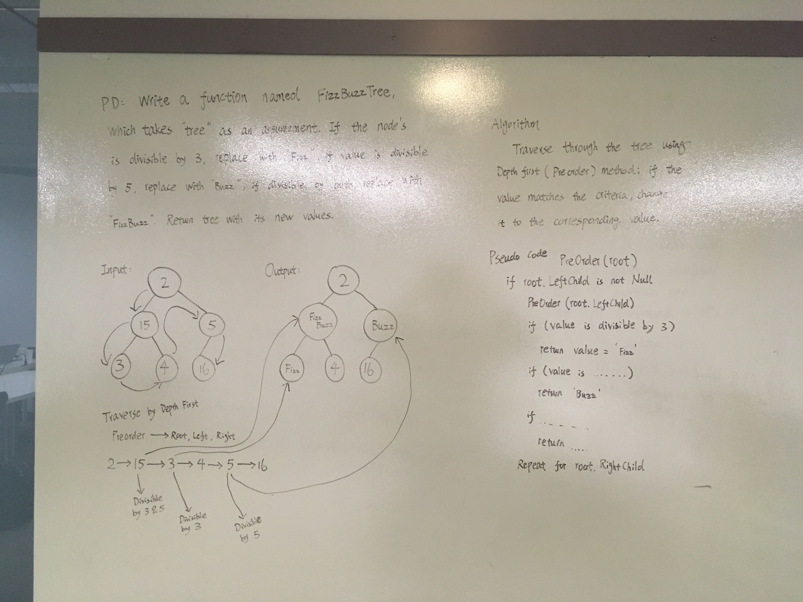

# FizzBuzz Tree
- Code Challenge 16

## Challenge 
- Write a function called FizzBuzzTree which takes a tree as an argument. Without utilizing any of the built-in methods available to your language, determine whether or not the value of each node is divisible by 3, 5 or both, and change the value of each of the nodes:
    - If the value is divisible by 3, replace the value with “Fizz”
    - If the value is divisible by 5, replace the value with “Buzz”
    - If the value is divisible by 3 and 5, replace the value with “FizzBuzz”
- Return the tree with its new values.

## Approach & Efficiency
I used a preorder method to traverse through the tree. Time complexity is O(n), because the function traverses through every single node, and running the function n times. For space complexity, it is also O(n), because there are n number of calls exist in the callstack. For space complexity, 

## Solution

