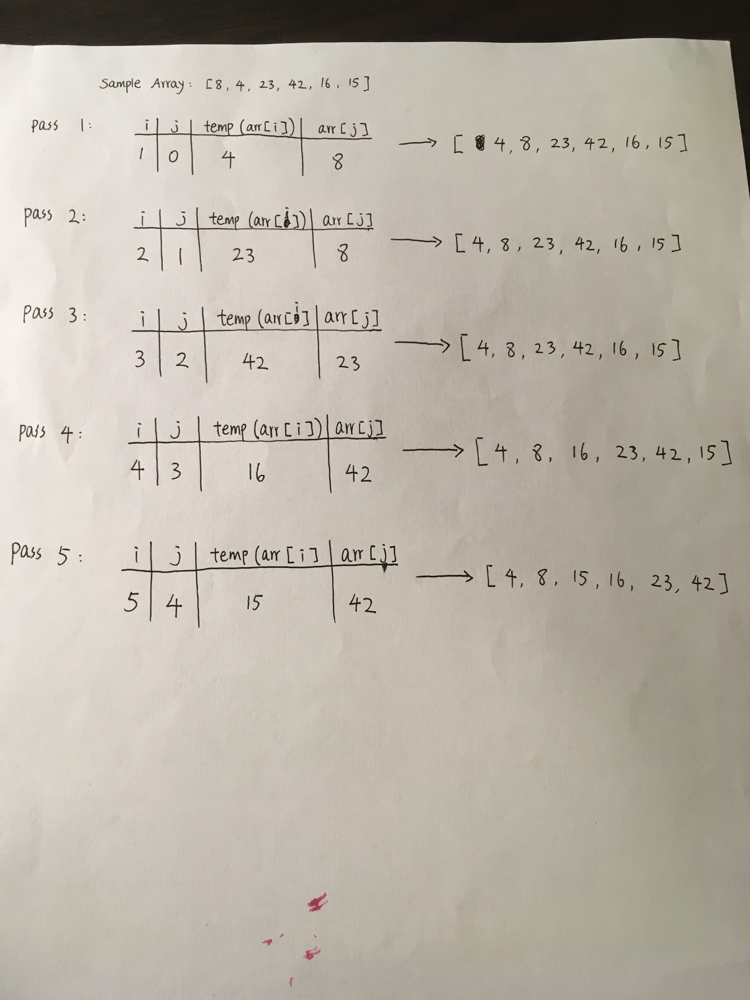

# Insertion Sort 
  Insertion sort is a sorting algorithm that builds the final sorted array one item at a time. 

## Pseudocode
```
 InsertionSort(int[] arr)
  
    FOR i = 1 to arr.length
    
      int j <-- i - 1
      int temp <-- arr[i]
      
      WHILE j >= 0 AND temp < arr[j]
        arr[j + 1] <-- arr[j]
        j <-- j - 1
        
      arr[j + 1] <-- temp
```

## Trace
Sample Array: [8,4,23,42,16,15]



- During pass 1, the first two values of the array, 8 and 4, are looked at. Since 8 is larger than 4, 8 is placed in front of 4. We now have [4,8,23,42,16,15].

- During pass 2, the next two values of the array, 8 and 23, are looked at. They are already in correct order, the condition doesn't meet the while loop standard, the array remains the same: [4,8,23,42,16,15].

- During pass 3, the next two values of the array, 23 and 42, are looked at. They are already in correct order, the condition doesn't meet the while loop standard, the array remains the same: [4,8,23,42,16,15].

- During pass 4, the next two values of the array, 42 and 16, are looked at. Since 42 is bigger than 16, 42 has taken 16's place, and 16 has been placed in between 8 and 23. We now have [4,8,16,23,42,15].

- During pass 5, the next two values ofthe array, 42 and 15, are looked at. Since 42 is bigger than 15, 42 has taken 15's place, and 15 has been placed in between 8 and 16. We finally have [4,8,15,16,23,42].

## Efficiency
- Time: O(n^2), because the operation scans through the list, and swaps elements if they are out of order. 

- Space: O(1), no additional space is being created; the array is being sorted in place. 