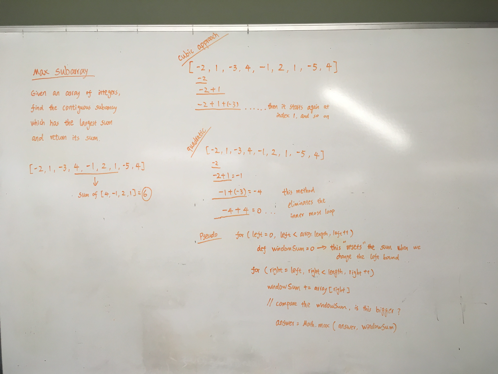
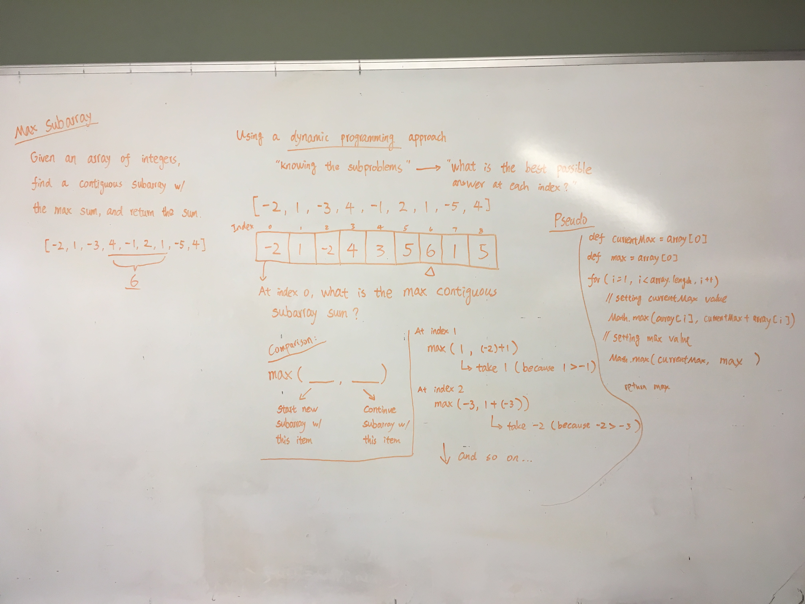

# Max Subarray

https://leetcode.com/problems/maximum-subarray/

Given an integer array `nums`, find the contiguous subarray (containing at least one number) which has the largest sum and return its sum.

Example:

```
Input: [-2,1,-3,4,-1,2,1,-5,4],
Output: 6
Explanation: [4,-1,2,1] has the largest sum = 6.
```

Helpful source:

[Video](https://www.youtube.com/watch?v=2MmGzdiKR9Y&t=594s)

[Code Source](https://github.com/bephrem1/backtobackswe/blob/master/Dynamic%20Programming%2C%20Recursion%2C%20%26%20Backtracking/MaxContiguousSubarraySum/MaxContiguousSubarraySum.java)

Whiteboard for approaches in cubic and quadratic time: 


Whiteboard for approach in linear time, using dynamic programming


Time Complexity: O(n)

Space Complexity: O(1)
