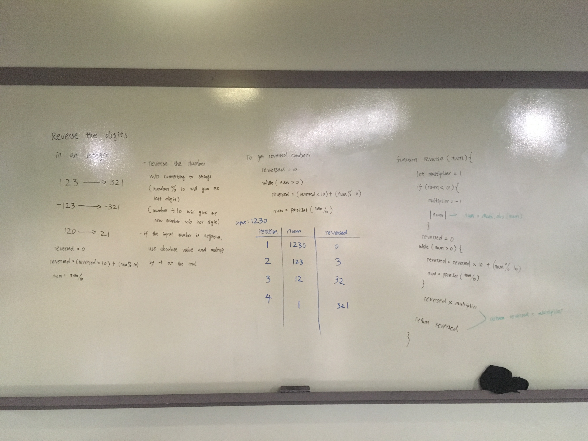

# Reverse Integer 
https://leetcode.com/problems/reverse-integer/

Given a 32-bit signed integer, reverse digits of an integer.

```
Example 1:

Input: 123
Output: 321
Example 2:

Input: -123
Output: -321
Example 3:

Input: 120
Output: 21
```

Whiteboard


Time Complexity: O(n)

Space Complexity: O(1)

Shout out to [Kyungrae](https://github.com/jeremymaya) for giving me the "light switch multiplier" idea! 