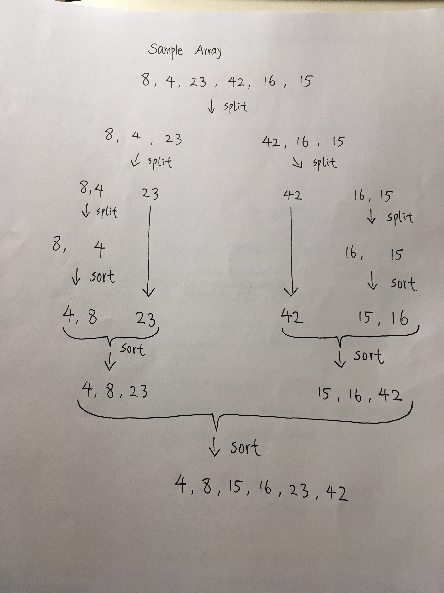

# Merge Sort

Merge sort is a divide and conquer algorithm. It divides input array in two halves, and calls itself for two haves, then merges the two sorted halves. 

## Pseudocode
```
  Mergesort(arr)
    let n = arr.length
           
    if n > 1
      let mid = n/2
      let left = arr[0...mid]
      let right = arr[mid...n]
      // sort the left side
      Mergesort(left)
      // sort the right side
      Mergesort(right)
      // merge the sorted left and right sides together
      Merge(left, right, arr)

  Merge(left, right, arr)
    let i = 0
    let j = 0
    let k = 0

    while i < left.length && j < right.length
        if left[i] <= right[j]
            arr[k] <-- left[i]
            i <-- i + 1
        else
            arr[k] <-- right[j]
            j <-- j + 1
            
        k <-- k + 1

    if i = left.length
       set remaining entries in arr to remaining values in right
    else
       set remaining entries in arr to remaining values in left
```
## Trace



## Efficiency
- Time complexity: O(nlogn); this is because of the master theorum.

- Space complexity: O(n); this depends on the height of the tree. 