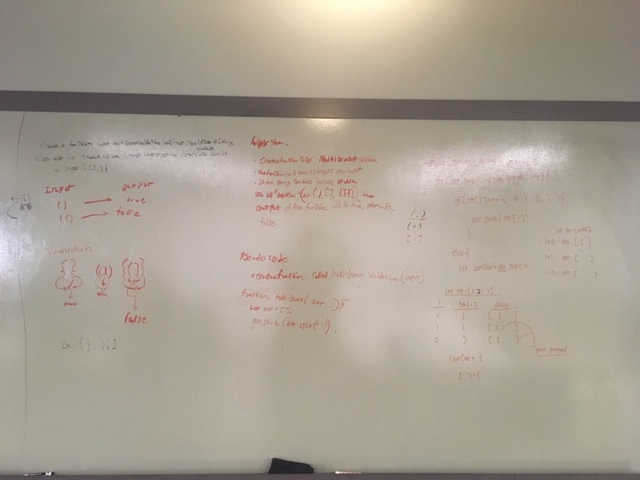

# Multi-Bracket Validation 

## Challenge 
Your function should take a string as its only argument, and should return a boolean representing whether or not the brackets in the string are balanced. There are 3 types of brackets:

Round Brackets : ()
Square Brackets : []
Curly Brackets : {}

## Approach & Efficiency
I first used regex to take out all the letters. Made an empty array to hold the opening brackets, an object that shows the "standard" of how the bracket pairs should look. Then used a for loop to compare the closing brackets and opening brackets against the known standard.

## Solution
