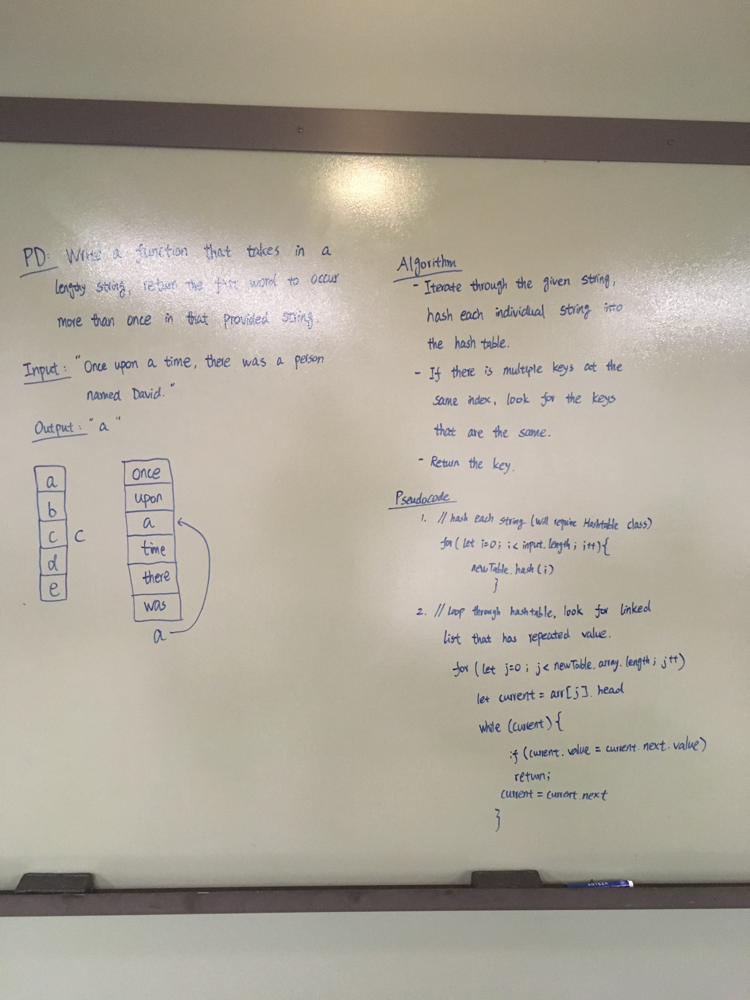

# Challenge Summary
Find the first repeated word in a book. 

## Challenge Description
- Write a function that accepts a lengthy string parameter.
- Without utilizing any of the built-in library methods available to your language, return the first word to occur more than once in that provided string.

## Approach & Efficiency
- The time complexity is O(n), because we are making "n" number of calls based on the length of the string.
- The space complexity is O(n), because "n" numbers of calls live in the callstack.  

## Solution

### Algorithm
 1. Create an empty object
 2. looping through the array of strings
 3. look for characters that have a space or punctuation following it
 4. compare that word against the object
  - if the word does not exist, push that word into the object
  - if the word exist, return the word