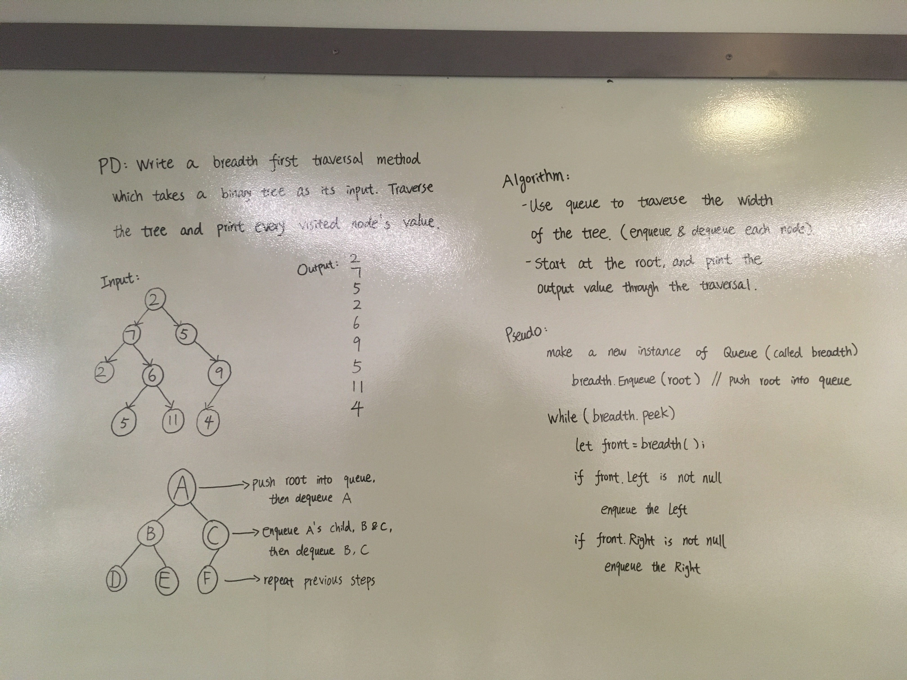

# Breadth First Tree Traversal
- Code Challenge 17

## Challenge 
- Write a breadth first traversal method which takes a Binary Tree as its unique input. Without utilizing any of the built-in methods available to your language, traverse the input tree using a Breadth-first approach; print every visited node’s value.

## Approach & Efficiency
I used a Queue class to produce an output of all the values using breadthfirst. The time complexity is O(n), because the function requires the traversal through every singe node. The space complexity is initially O(2n), because of the enqueing into the queue and the pushing into the arrays n times; however this can be reduced to O(n). 

## Solution

