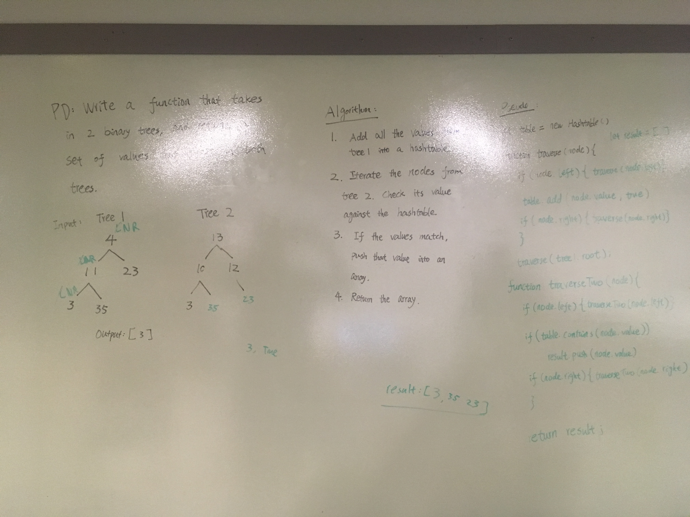

# Tree Intersection

## Challenge Description 
- Write a function called tree_intersection that takes two binary tree parameters.
- Without utilizing any of the built-in library methods available to your language, return a set of values found in both trees.

## Approach and Efficiency
- I used a hashtable to store the values of the first tree, and iterate through the second tree, compare its values against the hashtable, and return an array of common values. For time complexity, the big(O) would be O(n), because as the amount of nodes in the tree increases, the time it takes for the function to run also increases. For space complexity, the big(O) would also be O(n), because in the worst case scenario, the amount of values in the returning array would equal to the amount of function calls. 

## Solution 
